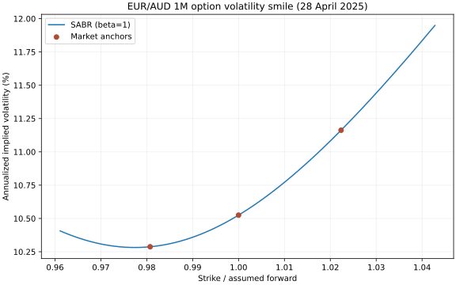

# FX Option Volatility Curve Construction

The first case study builds a **EUR/AUD one-month option volatility smile** in Python.



This is a **one-day SABR model calibration** using genuine EUR/AUD indicative FX option quotes from CME's TFS-ICAP sample dated **28 April 2025**. It uses a one-month ATM volatility, 25-delta risk reversal (RR), and 25-delta butterfly (BF). The original student's project uses a **market strangle**, which is a distinct quote convention. The BF-based exercise here reproduces the model-building workflow but does not claim to replicate that quote convention or the student's daily/weekend study.

## Research question

Given three near-simultaneous market quotes, can a beta=1 SABR model reproduce their implied volatility smile across EUR/AUD option strikes?

## How to run (Windows, VS Code)

1. Download the public [CME TFS-ICAP sample CSV](https://www.cmegroup.com/content/dam/cmegroup/files/download/TFSICAP_FXOptions_tick_20250428.csv) and save it in a local `data/` folder under this project. The CSV is deliberately not committed to GitHub.
2. Open this project's folder in VS Code. In **Terminal → New Terminal**, run `py -m pip install -r requirements.txt`.
3. Run:

   ```powershell
   py sabr_euraud.py "data/TFSICAP_FXOptions_tick_20250428.csv"
   ```

   If Windows named the download with `(1)` before `.csv`, use that filename inside the quotes instead.
4. Open `results/euraud_one_month_smile.png` and `results/quote_and_fit.json`.
5. To run the checks: `py -m unittest discover -s tests -v`.

## Track new quote dates in a separate script

The one-day smile above remains a standalone example. To build a history, save each **new day's**
TFS-ICAP FX option quote CSV inside `data/` and run:

```powershell
py track_daily_smiles.py
```

Open `results/euraud_daily_volatility.png` to see how the 25-delta put, ATM and
25-delta call implied volatilities change **across quote dates**. The JSON file
`results/euraud_daily_history.json` records the underlying figures and fitted
SABR parameters for each date. If more than one CSV describes the same day,
the script keeps the later synchronized set. Re-running updates the history.

To refresh automatically when you save a CSV while your computer and terminal
are running, use `py track_daily_smiles.py --watch`. Press **Ctrl+C** to stop.
This checks the folder once a minute; it does **not** download quotes. With only
the public sample, the chart has exactly one date, regardless of how often you
run it. Obtain actual new daily option quotes to build a multi-day study. A
study of weekend effects requires many dates and a specified expiry/calendar
day-count method, and is not included here.

## What the script does

1. Reads the vendor CSV and filters `EUR/AUD` and the one-month ATM, 25-delta RR and 25-delta BF records.
2. Chooses the most recent BF quote for which ATM and RR were refreshed within one second. The latest ATM of the day cannot be mixed with an hours-old BF as though they were simultaneous.
3. Converts each bid and ask to its midpoint. For the matched quote set at 05:30:34 **as timestamped in the source**, the midpoints are ATM **10.525%**, RR **+0.875 volatility points**, BF **+0.200 volatility points**. The corresponding 25-delta put and call anchor vols are **10.2875%** and **11.1625%** under the vendor's stated `CurrencyCode=1`, `PricingConvention=1` RR sign.
4. Converts those delta-based anchor vols to relative strikes using an *assumed* forward-delta convention, a normalized forward of 1, and an illustrative 30-calendar-day maturity. The source provides no exact expiry, forward or delta convention.
5. Fits Hagan's beta=1 lognormal SABR approximation to the three anchor points. Plots the fitted implied-volatility curve and writes parameters and residuals to JSON.

## How to read the result

The x-axis is **strike divided by the assumed FX forward**, not the actual EUR/AUD exchange rate. The three dots are quote-derived anchors; the line is the SABR interpolation. A very small error at the dots is expected when fitting **three free parameters to three targets**. It does **not** validate option prices at other strikes or show a profitable trading rule.

For market-standard calibration or actual option pricing, obtain the quote provider's delta and ATM conventions, exact expiry/cut date, contemporaneous FX forward and rates, and a separate set of option quotes to check the fitted curve. This single-day sample cannot establish the weekend effect or calculate a history of everyday curves. BF and broker/market-strangle quotes can differ; they must not be relabeled as each other.

## Sources

- [CME: TFS-ICAP FX Options data description and sample](https://cmegroupclientsite.atlassian.net/wiki/spaces/EPICSANDBOX/pages/457093337). Documents EUR/AUD coverage, record fields, RR sign codes, and the BF quote definition.
- [Hagan et al., *Managing Smile Risk*](https://derivativesacademy.com/storage/uploads/files/modules/resources/1702213496_hagan_kumar_lesniewski_woodward_managing_smile_risk.pdf). Original SABR implied-volatility approximation.
- [Reiswich and Wystup, *FX Volatility Smile Construction*](https://www.econstor.eu/bitstream/10419/40186/1/613825101.pdf). Explains FX smile quotation conventions and why market strangles and butterflies can differ.
